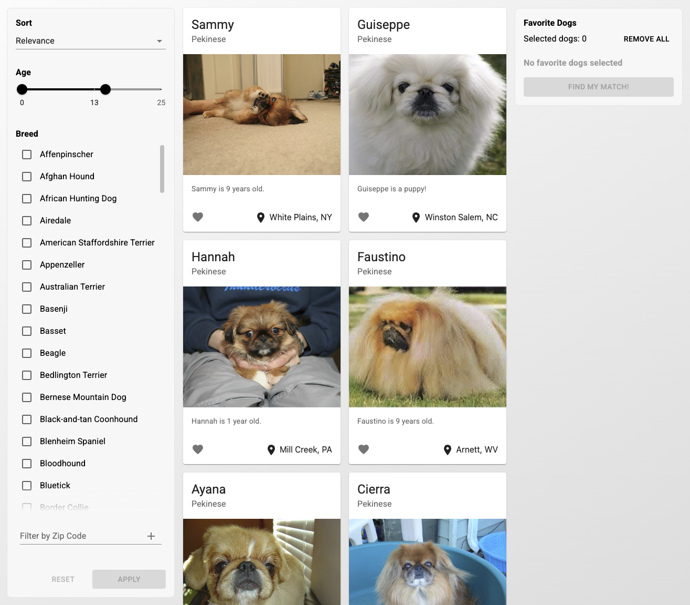
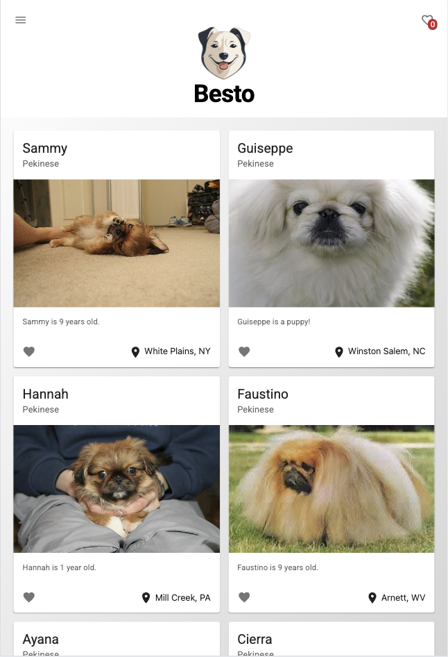
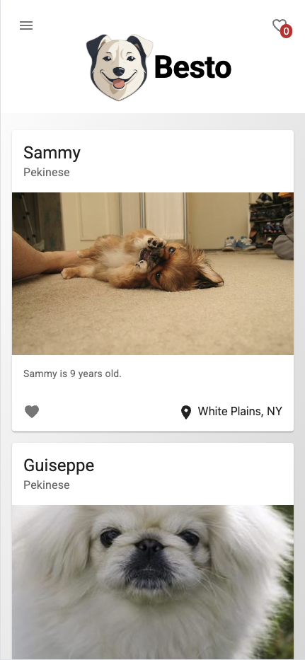

<div id="user-content-toc" align="center">
    <ul>
      <summary><h1 style="font-size:48px;padding:0;margin:0;">Besto</h1></summary>
      <summary><h3 style="font-size:16px;font-weight:400;padding:0;margin:0;">Let's find your best friend!</h3></summary>
    </ul>
</div>

# Welcome to Besto!

It's time to find your best friend! Use this app to filter through dogs and select your favorites. The app will then find a match for you. You can also filter results and sort them. You'll need to login with a name and an email. The app also features graceful error handling.

This app has been created for Fetch. Checkout the app live at [https://besto-five.vercel.app/](https://besto-five.vercel.app/)

## Responsiveness

The app is fully responsive, here is how it looks in different viewports:

Desktop: <br>


Tablet: <br>


Mobile: <br>


## Technologies Used

Besto was created with the following technologies:

-   Node 20
-   React 19
-   React Router
-   React Hook Form
-   React Intersection Observer
-   Vite
-   TypeScript
-   TailWind
-   Material UI

## installation

To run the app locally, clone the repo, then run:

```
npm install
```

To run the app in developemnt:

```
npm run dev
```

To run a production build of the app, first run:

```
npm run build
```

then

```
npm run preview
```

## Considerations

One thing I've noticed when testing the app on Safari for mac and ios, and chrome for ios, is that support for third-party cookie (which is the case here since the app and server are not hosted on the same domain) are being blocked by those browsers. One fix I found is to use [CHIPS](https://privacysandbox.google.com/cookies/chips) but it'll have to be implemented on the server-side.

As a quick temporary way to view the website on mobile and desktop Safari. Go to settings, then privacy, then uncheck `Prevent cross-site tracking`, that should let the browser save the cookie.

<h3 style="font-size:24px;" align="center">Thanks for checking the app out!</h3>
